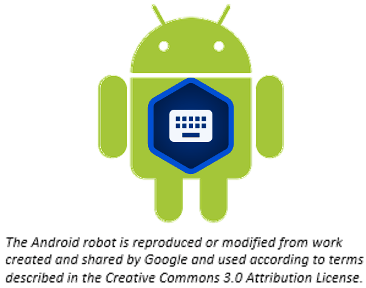

BTT Writer for Android™: Making Your Project Accessible
==========================================================

What Is Accessibility
---------------------

Accessibility means making a Bible translation available in whatever format the local church desires. Do they want to print copies as needed? Do they want to be able to view the project on a cell phone or tablet? 

Making Accessible on WACS
---------------------------------

When you upload your work to the Wycliffe Associates Content Server (WACS) it is automatically available online under your user account.  You can upload to the server as often as you wish to create a backup of your work. (See `Upload/Export Your Work <https://btt-writer.readthedocs.io/en/latest/dUpload.html>`_.) When you upload, BTT Writer displays the direct URL for your project on the WACS server.

Uploaded translations are available online to anyone at the URL: https://content.bibletranslationtools.org. For user friendly content, click **See in Reader**, or use the URL https://read.bibletranslationtools.org.

From the WACS project page you can:

*	See the web version of a project 

*   Download the repository as a zip or TAR file

*	Download the source files (USFM) for a project

*   View or print warning and error messages

*	Interact with others about a project

*   Print the translation

Making Accessible on Bible in Every Language
---------------------------------------------

Several translations are available for viewing in the Bible in Every Language website (BIEL) at https://bibleineverylanguage.org/translations. You can work through your contact at WA to get a translation published on BIEL.

Reviewing the Project
----------------------------------------

You can use BTT Writer to ensure that the project is complete and that all contributors are listed. You can perform project review by completing the following steps:

1.	In BTT Writer, load your project.

2.	Click the 3-dot icon to access the options menu.

3.	Click Project Review (the double check marks icon).

    *	Click the Project tab -- Review sections of the book for final review. 

      1.	We suggest that you review any chunk that has a review button. These are chunks that are not marked done.

      2.	Click the Review button to finish translating, or set the verse markers and then slide the 'done' toggle.

    *	Click the Contributors tab -- This is where you enter who translated the work. Remember that the names will be publicly available.

      1.	Click the Name or Pseudonym line and enter a contributor’s name, or their pseudonym if they do not wish their name to be published. 
 
      2.	Click the check box to indicate that this person has agreed to the terms of use.
      
      3.    Click Add Contributor to add the translator.
 
      4.    When you have finished adding contributors, click Next to continue.

    •	When you either click Next in the step above, or click the Upload/Export tab, you are presented with Upload/Export Options. 

      1.	Select Upload to Server (requires an Internet connection). Note: The server to which the project will be uploaded in the one specified in the  Server Suite setting -- see `BTT Writer for the Desktop: Modifying Program Settings <https://btt-writer.readthedocs.io/en/latest/dSettings.html>`_.

      2.	A pop-up message appears after a successful upload. This pop-up message includes the repository that the translation is in on the content server. 

      3.	Click the link to view the repository. If you are viewing the WACS server, click "See in Reader" for a read-friendly view.

**Must All Contributors Be Named?**

Due to copyright laws (and these exist no matter what country you are in and no matter what people tell you about laws in that country), you must list every contributor as they prefer to be mentioned -- the person's name or pseudonym.

Reviewing the Project
^^^^^^^^^^^^^^^^^^^^^^

You can use BTT Writer to ensure that the project is complete and that all contributors are listed. You can perform project review by completing the following steps to publish your work:

1.	In BTT Writer, load your project.

2.	Tap the 3-dot icon to access the options menu.

3.	Tap **Project Review** (the double check marks icon).

    *	Tap the **Project** tab -- Review sections of the book for final review. 

      1.	We suggest that you review any chunk that has a review button. These are chunks that are not marked done.

      2.	Tap the **Review** button to finish translating or set the verse markers and then slide the 'done' toggle.

    •	Tap the **Contributors** tab -- This is where you enter who translated the work. Remember that the names will be publicly available.

      1.	Tap **Add Contributor**.
 
      2.	In the Add Contributor pop-up window:

        *	Tap the **Name or Pseudonym** line and enter the contributor’s name or pseudonym.

        *	Tap the **check box** to indicate that this person has agreed to the terms of use.
        
        *	Tap **Save** to add the translator.
 
      3.	Repeat steps 1 and 2 above for each contributor you want to add. 

      4.	When you have finished adding contributors, tap Next to continue, or tap the Upload/Export tab.
      
    .. note:: You can edit a contributor's name by tapping the pencil icon. 

    •	When you either tap **Next** in the step above, or tap the **Upload/Export** tab, you are presented with Upload/Export Options. 

      1.	Tap **Upload to Server** (requires an Internet connection). 

      2.	A pop-up message appears after a successful upload. This pop-up message includes the repository that the translation is in on the server. 

      3.	Tap **VIEW ONLINE** to view the repository. 
      
      4.    In the repository, tap "**See in Reader** to see a read-friendly view of the project.

Source Text Request Form
^^^^^^^^^^^^^^^^^^^^^^^^

Once you have the prerequisites, you may fill out the source text request form at http://ufw.io/pub/. A few notes about the form:

*	You must have a server account to create a request.

*	You must include the names or pseudonyms of everyone involved. You must also include their server usernames if you are not attaching signed license agreements for them.

*	Note that the information you enter will be public and will become a part of the front matter of the source text.

After you submit the form, you will be contacted if anything is missing. Once the request has been approved, it will go into the publishing queue where a developer will work to make the translation a source text. You may also be contacted by the developer if there are any issues encountered during the publishing process. You will be notified when the process is completed and you may review a PDF of the work.

Questions Regarding the Request to Publish Form and Process
^^^^^^^^^^^^^^^^^^^^^^^^^^^^^^^^^^^^^^^^^^^^^^^^^^^^^^^^^^^^^^^

**What Happens After Text is Approved?**

When the Request to Publish is approved, the text is made available on unfoldingword.org for online viewing, as a downloadable, print-ready PDF, and it appears in the unfoldingWord app.

**Can Text Be Changed After Level 3 Checking?**

Approved text can always be modified in BTT Writer even after all checking levels are completed, HOWEVER if you or another user were to submit a Request to Publish for text that has already completed Level 3 checking, there would be questions regarding the reason for overwriting the previously published and checked materials. The approver will look to see who contributed to the change and may contact the requestor and others involved with the translation of the text in question to ensure the changes are valid.

**Must All Contributors Be Named?**

Due to copyright laws (and these exist no matter what country you are in and no matter what people tell you about laws in that country), you must list every contributor as they prefer to be mentioned.  Normally this is the person's name or pseudonym.
